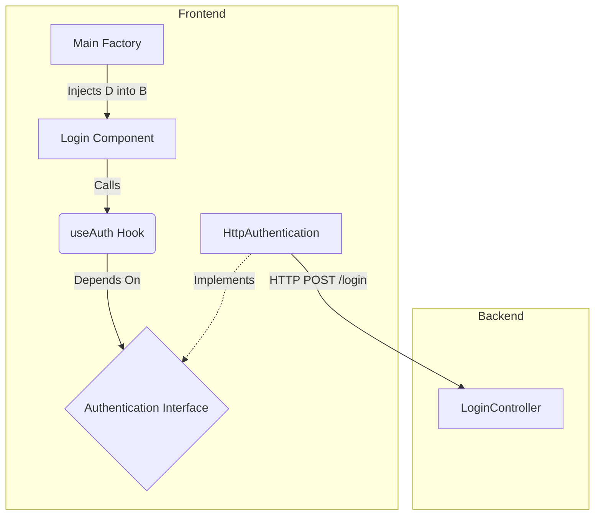

# <role>
# You are the SOFTWARE ARCHITECT (ARC).
# </role>

<architecture_decision>
## Problem
The "Login Screen" task requires integrating a new Frontend implementation with an *existing* Backend authentication service. We must ensure the Frontend is decoupled, testable, and strictly adheres to the Backend's API contract without inducing regression.

## Drivers
- **Maintainability**: Frontend code must be easy to change if the auth provider changes.
- **Testability**: Logic must be testable without a real backend (TDD).
- **Consistency**: Must follow the project's Clean Architecture guidelines.

## Solution
We will implement a **Clean Architecture** approach on the Frontend:

1.  **Domain Layer** (`src/domain`):
    -   Model: `AccountModel` (accessToken, name, etc).
    -   UseCase Interface: `Authentication` (`auth(params): Promise<AccountModel>`).
2.  **Infrastructure Layer** (`src/infrastructure`):
    -   Implementation: `HttpAuthentication` (implements `Authentication` using Axios/Fetch).
3.  **Presentation Layer** (`src/presentation`):
    -   UI: `Login` component.
    -   State Management: `useAuth` hook (consuming `Authentication`).
4.  **Main Layer** (`src/main`):
    -   Factory: `makeLoginPage` (Composes `HttpAuthentication` and injects it into `Login`).

## Diagram

## Consequences
- **Positive**: High testability (can mock `Authentication`), clear separation of concerns.
- **Negative**: Boilerplate for a simple login form (Factories, Interfaces).
</architecture_decision>

<technical_constraints>
- **Library usage**: `axios` for HTTP, `react-hook-form` (optional) or controlled inputs for State.
- **Pattern enforcement**: 
    - **Dependency Injection**: `Login` component must receive its dependencies (or a custom hook configured via Context/Factory).
    - **No Business Logic in UI**: `Login.tsx` must only handle rendering and user events.
- **File structure**:
    - `src/domain/usecases/authentication.ts`
    - `src/domain/models/account-model.ts`
    - `src/infrastructure/http/http-authentication.ts`
    - `src/presentation/pages/login/login.tsx` (or `login-page.tsx`)
    - `src/main/factories/pages/login/login-factory.tsx`
</technical_constraints>
