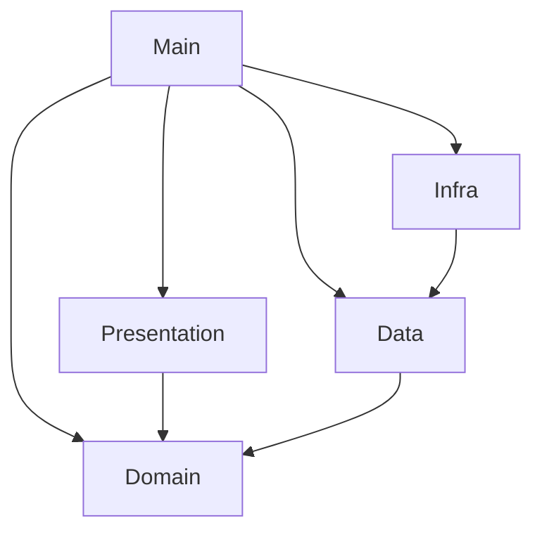

# <role>
# You are the SOFTWARE ARCHITECT (ARC).
# </role>

<architecture_decision>
## Problem
The Backend application is growing, and we observe an implicit structure of folders (`domain`, `infra`, `presentation`, `main`). However, there is no explicit record defining the architectural pattern, leading to potential future violations (e.g., Domain layer depending on Infrastructure). We need to formalize the architecture to ensure consistency and maintainability.

## Drivers
- **Independence of Frameworks**: The architecture does not depend on the existence of some library of feature laden software.
- **Testability**: The business rules can be tested without the UI, Database, Web Server, or any other external element.
- **Independence of UI**: The UI can change easily, without changing the rest of the system.
- **Independence of Database**: You can swap Oracle or SQL Server, for Mongo, BigTable, CouchDB, or something else. Your business rules are not bound to the database.

## Solution
We explicitly adopt **Clean Architecture** (Robert C. Martin) for the Backend.

### Layers defined:

1.  **Domain Layer** (`src/domain`):
    -   **Enterprise Business Rules** (Entities).
    -   **Application Business Rules** (Use Cases).
    -   *Rule*: MUST NOT depend on any other layer. Pure TypeScript.

2.  **Application Layer** (`src/application`? or mixed in `data/usecases`?):
    -   *Current Codebase Note*: Seems to be implemented as `data` layer implementing UseCases.
    -   We define **Data/Application** layer as the implementation of UseCases that coordinate data flow.
    -   *Rule*: Depends ONLY on Domain.

3.  **Infrastructure Layer** (`src/infra`):
    -   **Frameworks & Drivers**: Database access (Prisma/TypeORM/Mongo), Cryptography, External APIs.
    -   *Rule*: Implements interfaces defined in Domain/Application.

4.  **Presentation Layer** (`src/presentation`):
    -   **Interface Adapters**: Controllers, Presenters, ViewModels.
    -   *Rule*: Receives Requests, calls UseCases, returns Responses. Depends on Domain.

5.  **Main Layer** (`src/main`):
    -   **Composition Root**: Factories, Adapters, Configuration.
    -   *Rule*: The "Dirty Layer". It knows everything and injects dependencies. connect `infra` into `presentation`.

## Diagram

## Consequences
- **Positive**: High testability, separation of concerns, flexibility to switch libraries.
- **Negative**: High file count, boilerplate code (Interfaces, DTOs, Factories).
</architecture_decision>

<technical_constraints>
- **Dependency Rule**: Source code dependencies must only point inward, toward higher-level policies.
- **Factories**: All object creation and wiring MUST happen in `src/main/factories`.
- **Adapters**: Use Adapters to decouple Protocol/Framework (Fastify/Express) from Controllers.
</technical_constraints>
