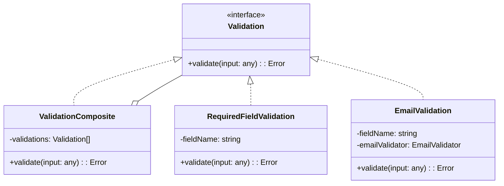

# <role>
# You are the SOFTWARE ARCHITECT (ARC).
# </role>

<architecture_decision>
## Problem
Controllers often become bloated with validation logic (checking required fields, email formats, etc.), violating the Single Responsibility Principle. We need a standard way to handle validation that is reusable, testable, and decoupled from the specific HTTP framework or Controller logic.

## Drivers
- **SRP**: Controllers should only handle HTTP concerns, not validation rules.
- **Reusability**: Validation rules (e.g., "Email is valid") should be reusable across different controllers.
- **Open/Closed**: It should be easy to add new validation rules without modifying existing code.

## Solution
We implement a **Validation Composite** pattern in the `presentation` layer.

1.  **Protocol**: Define a `Validation` interface.
    ```typescript
    export interface Validation {
      validate: (input: any) => Error
    }
    ```

2.  **Validators**: Implement small, specific classes implementing this interface.
    -   `RequiredFieldValidation`
    -   `EmailValidation`
    -   `CompareFieldsValidation`

3.  **Composite**: A `ValidationComposite` class that takes an array of `Validation` objects and runs them sequentially.
    -   If any fails, it returns the error immediately.
    -   If all pass, it returns null.

4.  **Factory**: Validation instances are composed in the `main` layer factories and injected into Controllers.

## Diagram


## Consequences
- **Positive**: perfectly clean controllers, easy to unit test validators in isolation.
- **Negative**: More classes to create for simple validations.
</architecture_decision>

<technical_constraints>
- **No external libs in Presentation**: Validators should not depend directly on libs like `joi` or `zod` inside the presentation layer. If using them, wrap them in an Adapter.
- **Controller Injection**: Controllers MUST receive a `Validation` instance in their constructor.
</technical_constraints>
