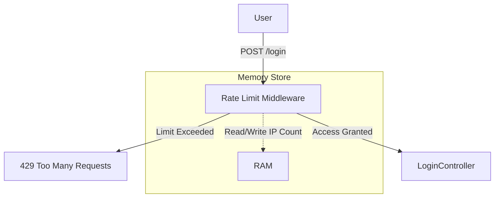

# <role>
# You are the SOFTWARE ARCHITECT (ARC).
# </role>

<architecture_decision>
## Problem
The system requires protection against Brute Force attacks on the login endpoint (`/login`). We need to determine where to store the attempt count (state) to enforce blocking.

## Drivers
- **Security**: Prevent credential stuffing and brute force.
- **Simplicity**: Avoid complex infrastructure for the initial phase.
- **Performance**: Low latency for checking attempts.

## Solution
We choose to use **In-Memory Storage** via the `@fastify/rate-limit` library.

## Diagram

## Consequences
- **Positive**:
    - **KISS**: Zero external dependencies (no Redis required yet).
    - **Speed**: Immediate implementation and fast lookup.
- **Negative**:
    - **Scalability**: State is not shared between replicas. If scaled to N instances, the effective limit is N * Limit.
    - **Volatile**: Restarts clear the limits (acceptable for login security).

## Mitigation
We accept the scalability risk for the current phase. If/When we migrate to Kubernetes with multiple replicas, we MUST change the Rate Limit driver to Redis (Future ADR).
</architecture_decision>

<technical_constraints>
- **Library usage**: `@fastify/rate-limit`
- **Configuration**:
    - Window: 1 minute
    - Max: 10 attempts
- **Scope**: Apply primarily to `/login` and public routes.
</technical_constraints>
