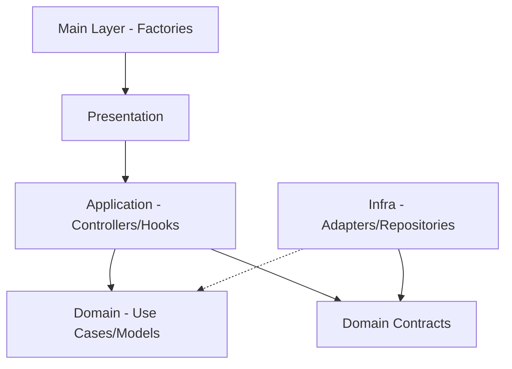

# <role>
# You are the SOFTWARE ARCHITECT (ARC).
# Your output MUST be a new ADR (Architectural Decision Record).
# </role>

<architecture_decision>
## Problem
The frontend currently has logic leakage between layers, direct dependencies on mock data in presentation components, and an inconsistent folder structure that doesn't fully align with the IDS Clean Architecture standard.

## Drivers
- Maintainability
- Testability (TDD Support)
- Pattern Consistency

## Solution
Apply a strict Layered Clean Architecture and standardize patterns across the frontend.

### Dependency Flow
Components (`Presentation`) -> Controllers/Hooks (`Application`) -> Use Cases (`Application`) -> Entities/Rules (`Domain`).
Infrastructure (`Infra`) implements contracts defined in `Domain`.

### Patterns to Apply
- **Facade**: Use Facades in the `Application` layer to simplify complex interactions for the UI.
- **Repository Pattern**: All data fetching (local/remote) must go through a Repository in `Infra`.
- **Error Boundary**: Wrap main routes and independent widgets.
- **Dependency Injection**: Use factories in the `Main` layer to wire dependencies.

## Diagram

## Consequences
- **Positive**: Isolated testing of business logic; easier to swap Mocks for real API calls; UI becomes truly "Passive".
- **Negative**: Increased initial boilerplate (factories/interfaces).
</architecture_decision>

<technical_constraints>
- **Library usage**: Keep `react-router-dom`, `react-hook-form`, `zod`.
- **Pattern enforcement**: Controllers MUST be in `application/controllers` or `application/hooks`. No `useEffect` calling APIs inside components.
- **File structure**:
  - `src/domain`: models, contracts, errors.
  - `src/application`: usecases, controllers.
  - `src/infra`: cache, http, gateways.
  - `src/presentation`: Shared styling, assets, and the `react/` framework entry.
    - `src/presentation/react`: All framework-specific code (.tsx).
      - `components/`, `pages/`, `contexts/`, `hooks/`.
  - `src/main`: factories, routes, composition.
</technical_constraints>

<architecture_decision>
### Mock Replacement Policy (Frontend-Infra)
To ensure smooth transition from development to production without data loss or feature breakage:

1. **Endpoint Audit**: Before implementing a feature, developers must audit `app/backend/src/main/routes` for matching endpoints.
2. **Implementation Strategy**:
   - **Endpoint Available**: Use cases must consume the corresponding `HttpRepository`. 
   - **Endpoint Unavailable**: Use cases must consume a `StubRepository` or `MockRepository` located in `src/infra/mocks`. 
3. **TODO Enforcement**: Files using `MockRepository` MUST contain a header comment `// TODO: Replace with HttpRepository when Backend Task X is complete`.
4. **No Premature Deletion**: Mocks MUST NOT be removed until their backend counterpart is fully functional and integrated.
</architecture_decision>
