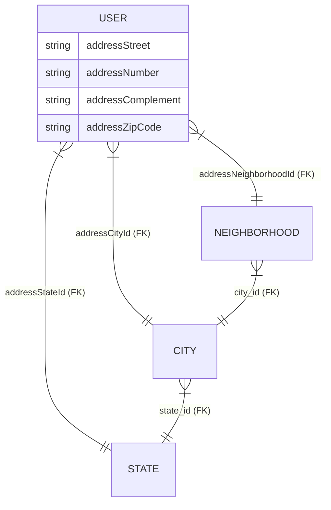

<thinking>
The user corrected the requirements:
1. Street (Logradouro) remains a text column.
2. Neighborhood (Bairro) MUST be a Foreign Key to the `Neighborhood` entity.
3. City (Cidade) MUST be a Foreign Key to the `City` entity.
4. State (Estado) MUST be a Foreign Key to the `State` entity.

**Migration Analysis**:
The existing migrations (`CreateCity`, `CreateNeighborhood`) define columns but DO NOT create Foreign Key constraints in the database.
The `RefactorUserDomain` migration explicitly DROPPED `address_state` and created `address_city_id` and `address_neighborhood_id` as simple varchar columns without FK constraints.

**Conclusion**: The current database schema is strictly structural (tables and columns exist) but lacks relational integrity.
</thinking>

# [REPORT] Address Architecture Repair

<architecture_decision>
## Problem
The current database schema lacks Referential Integrity.
- `state_id` in `city` table is just a string, not a Foreign Key.
- `city_id` in `neighborhood` table is just a string, not a Foreign Key.
- `users` table lacks `address_state_id`.
- `users` table has `address_city_id` and `address_neighborhood_id` as unconnected strings.

## Drivers
- **Data Integrity**: Enforce strict Referential Integrity for State, City, and Neighborhood hierarchies.
- **Normalization**: Ensure no orphan or invalid geo-references exist.
- **Flexibility**: Keep `Street` (Logradouro) as a text field for flexibility.

## Solution
We will strictly define the relationships in the `UserTypeOrmEntity` AND generate a new Migration to enforce them:
1.  **DB Migration**: Create a new migration `CreateStrictGeoFks` to:
    - Add `address_state_id` to `users`.
    - Add Foreign Key constraints to `neighborhood`, `city`, and `users` tables.
2.  **ORM Definition**: Update `UserTypeOrmEntity` with `@ManyToOne` decorators.
3.  **Domain Flow**: flow the `stateId` through the Address Value Object.

## Diagram


## Consequences
- **Positive**:
    - Impossible to have a City pointing to a non-existent State.
    - Impossible to have a User pointing to a non-existent Neighborhood.
- **Negative**:
    - Existing bad data (if any) might prevent migration from running (requires cleanup or cascade). *Assuming fresh dev environment for now given the context.*
</architecture_decision>

<technical_constraints>
- **Strict Migrations**: Do not rely on valid data being assumed; enforce it with constraints.
- **Strict Typing**: `Address` Value Object must carry valid UUIDs for `stateId`, `cityId`, and `neighborhoodId`.
</technical_constraints>

```json
{
  "project_state": {
    "track": "PROTOCOL",
    "context": "BACKEND",
    "current_phase": "ARC",
    "story_id": "app/docs/stories/story_address_fix.md",
    "spec_id": "app/docs/specs/reports/qa/ADR_ADDRESS_REPAIR.md"
  },
  "handoff": {
    "from": "ARC",
    "to": "DEV",
    "status": "SUCCESS",
    "reason": "Defined strict Foreign Key architecture with required Migration plan."
  },
  "next_prompt": "Create the migration `CreateStrictGeoFks` to add missing FKs and rework the User entity to use them."
}
```
