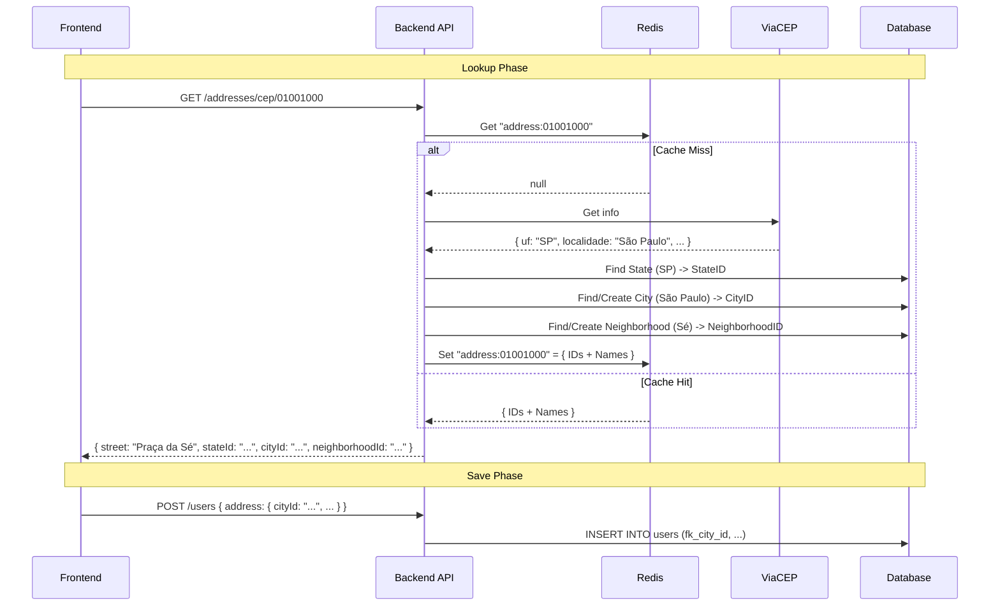

<thinking>
The user demanded a full breakdown of the Address Architecture, covering:
1.  **Population**: How State/City/Neighborhood get into the DB.
2.  **Data Flow**: Frontend (ZIP) -> Backend (IDs) -> Frontend -> Backend (Save).
3.  **Caching**: Redis usage.
4.  **Domain Integrity**: Aggregate root logic.

**Current State**:
- `AddressGateway` returns strings (DTO).
- `CachedAddressGateway` caches these strings.
- `GetOrCreateGeoEntityService` resolves strings to IDs (persisting if needed).

**Proposed Flow (Efficiency + Integrity)**:
1.  **Lookup (GET /addresses/cep/:zipCode)**:
    - Check **Redis** for `cep:{zipCode}` (Structure: `{ street, neighborhood, city, state, stateId, cityId, neighborhoodId }`).
    - If miss:
        - Call **ViaCEP** (returns strings).
        - Call `GetOrCreateGeoEntityService` immediately to resolve strings -> IDs (ensuring DB population).
        - Cache the result (DTO + IDs) in **Redis**.
    - Return payload to Frontend: `{ street, number: '', zipCode, stateId, cityId, neighborhoodId, neighborhoodName, cityName, stateUf }`.

2.  **Population Strategy**:
    - **State**: Seeded via Migration (already done).
    - **City**: Seeded via Migration (partial) OR Created On-Demand via `GetOrCreateGeoEntityService` during lookup.
    - **Neighborhood**: Created On-Demand via `GetOrCreateGeoEntityService` during lookup.
    - *Note*: "On-Demand" is the most robust strategy for City/Neighborhood to avoid massive initial seeds + maintenance of outdated lists. ViaCEP is the source of truth for names, our DB is the source of truth for relationships.

3.  **Domain Save (POST /users)**:
    - User Aggregate receives `Address` Value Object containing: `street` (string) + `stateId` (UUID) + `cityId` (UUID) + `neighborhoodId` (UUID).
    - Aggregate validates existence/format.
    - Persistence saves with FKs.
</thinking>

# [REPORT] Complete Address Architecture & Data Flow

<architecture_decision>
## Problem
We need a robust, efficient, and consistent way to handle Addresses, ensuring:
- **Frontend** receives pre-resolved relationships (IDs) to simplify form submission.
- **Backend** enforces strict Referential Integrity (Foreign Keys).
- **Performance** is optimized via Redis caching.
- **Data Population** handles the vast number of Brazilian cities/neighborhoods without massive initial seeds.

## Drivers
- **UX/Efficiency**: Frontend should auto-fill and "lock" the State/City/Neighborhood fields based on valid IDs.
- **Data Integrity**: No broken relationships in the database.
- **Scalability**: Use Redis to avoid hitting ViaCEP/DB repeatedly for common addresses.

## Solution

### 1. Data Population Strategy (Hybrid)
We will use a **Lazy Population** strategy for Cities and Neighborhoods, backed by a **Static Seed** for States.
- **States**: Populated via Migration (already implemented). Static source of truth.
- **Cities & Neighborhoods**: Populated **On-Demand** when a ZIP code is looked up for the first time.
    - *Why?* There are 5,570+ cities and countless neighborhoods. Maintaining this locally is hard. ViaCEP provides the canonical names. When a user looks up a Zip, we *ensure* those entities exist in our DB, defining the canonical IDs for our system.

### 2. The Lookup Flow (GET /addresses/cep/:zipCode)
The backend endpoint acts as an intelligent proxy and resolver.

**Sequence:**
1.  **Frontend** sends `GET /addresses/cep/12345678`.
2.  **Backend (Cache)** checks Redis key `address:12345678`.
    - *Hit*: Return Cached DTO (includes IDs).
3.  **Backend (Miss)**:
    - Call **ViaCEP** -> returns `{ logradouro, bairro, localidade, uf }`.
    - Call **GeoService**:
        - Find State by UF (Error if missing).
        - Find or Create City by Name + StateId.
        - Find or Create Neighborhood by Name + CityId.
    - **Construct DTO**: `{ street: logradouro, streetId: null, neighborhoodId: uuid, cityId: uuid, stateId: uuid, ...metadata }`.
    - **Cache**: Save to Redis (TTL 7 days).
4.  **Frontend** receives the DTO with IDs.
5.  **Frontend Form** pre-selects the dropdowns/hidden fields using the IDs.

### 3. The Save Flow (POST /users)
The command side assumes valid IDs were already obtained (or manually selected if Zip search failed).

**Sequence:**
1.  **Frontend** submits payload:
    ```json
    {
      "name": "Leo",
      "address": {
        "zipCode": "12345678",
        "street": "Rua Exemplo",
        "number": "123",
        "neighborhoodId": "uuid-bairro",
        "cityId": "uuid-cidade",
        "stateId": "uuid-estado"
      }
    }
    ```
2.  **Controller** passes data to `AddUser` Usecase.
3.  **Domain (User Aggregate)** creates `Address` Value Object.
    - **Validation**: Ensure IDs are valid UUIDs.
4.  **Repository**: Saves `User` with strict Foreign Key relationships.

## Diagram (Data Flow)



## Consequences
- **Positive**:
    - Frontend is "dumb" regarding geo-resolution; it just passes IDs.
    - Database grows organically with valid data.
    - Performance is high due to Redis.
- **Negative**:
    - First lookup for a city is slightly slower (DB writes).
    - Requires strict synchronization between ViaCEP names and DB names (handled by the service).
</architecture_decision>

<technical_constraints>
- **Service Layer**: The `CreateStrictGeoFks` migration is a prerequisite.
- **Adapter Interface**: Update `CachedAddressGateway` / `AddressResolutionService` to return `ResolvedAddressDTO` which includes IDs.
</technical_constraints>

```json
{
  "project_state": {
    "track": "PROTOCOL",
    "context": "BACKEND",
    "current_phase": "ARC",
    "story_id": "app/docs/stories/story_address_fix.md",
    "spec_id": "app/docs/specs/reports/qa/ARCH_ADDRESS_FULL_FLOW.md"
  },
  "handoff": {
    "from": "ARC",
    "to": "DEV",
    "status": "SUCCESS",
    "reason": "Full architectural flow defined including caching, population, and integrity."
  },
  "next_prompt": "Wait for user approval of ARCH_ADDRESS_FULL_FLOW.md before executing code changes."
}
```
